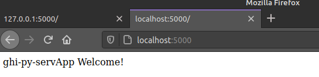

# ghi-py-serApp
> Web Server App in Flask Framework

## Table of contents
* [General info](#general-info)
* [Screenshots](#screenshots)
* [Technologies](#technologies)
* [Setup](#setup)
* [Features](#features)
* [Status](#status)
* [Inspiration](#inspiration)
* [Contact](#contact)

## General info
Add more general information about project. What the purpose of the project is? Motivation?

## Screenshots

## Technologies
* Python 3.8

## Setup
* Describe how to install / 
* setup your local environment /
* to recreate:'$ conda env create -f condaEnv-ghi-py-servApp.yml -n <your_environment_name>'
* to activate env:'$ conda activate <your_environment_name>'
* install pip requirements:'$ pip3 install -r requirements_pip3.txt'
* how to launch: '$ gunicorn --bind 0.0.0.0:8080 run_wsgi:app'
* flask launch (local): '$ export FLASK_APP=app && export FLASK_ENV=development && flask run'
* db: '$  flask init-db  '

add link to demo version. /

## Code Examples
Show examples of usage:
`put-your-code-here`

## Features
List of features ready and TODOs for future development
* Awesome feature 1
* Awesome feature 2
* Awesome feature 3

To-do list:
* Wow improvement to be done 1
* Wow improvement to be done 2

## Status
Project is: _in progress!!_

## Inspiration
Based on: https://flask.palletsprojects.com/

## Contact
Created by [@ghillaz](https://github.com/ghillaz/) - feel free to contact me!